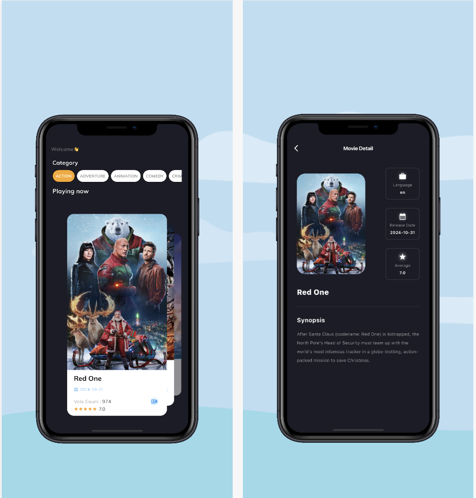

# Film Catalog 🎬

Film Catalog is a mobile application built with Flutter that allows users to browse, search, and view information about movies. The project follows **Clean Architecture** principles and leverages modern tools and libraries such as **GetX**, **Dio**, and **GetIt**.

---

## 🚀 Main Features

- **Browse Movies:** Explore a list of movies categorized by genre.
- **Now Playing:** View currently playing movies in theaters.
- **Movie Details:** Get detailed information about a specific movie.

---

## 🛠️ Technologies Used

### Framework and Language:

- **[Flutter](https://flutter.dev/):** Open-source framework for cross-platform development.
- **Dart:** Programming language used by Flutter.

### Architecture:

- **[Clean Architecture](https://github.com/ardalis/CleanArchitecture):** Clear separation of responsibilities into layers:
  - **Domain:** Contains use cases and entities.
  - **Data:** Handles repositories and data sources (e.g., APIs).
  - **Presentation:** UI widgets and state management.

### Libraries:

- **[GetX](https://pub.dev/packages/get):** State management, navigation, and dependency injection.
- **[Dio](https://pub.dev/packages/dio):** Powerful HTTP client for API calls.
- **[GetIt](https://pub.dev/packages/get_it):** Service Locator for managing dependencies.

---

### 🔧 API Configuration:

- This project uses a third-party API (e.g., TMDB) to fetch movie data.
- Add your API key in an environment file or directly in the code, depending on your setup.

---

## 📂 Project Structure

```plaintext
lib/
├── data/                # Data layer (models, repositories, API calls).
│   ├── models/          # Data models.
│   ├── repositories/    # Repositories for data handling.
│   ├── providers/       # API implementation using Dio.
│
├── domain/              # Domain layer.
│   ├── entities/        # Business entities.
│   ├── usecases/        # Use cases.
│   ├── repositories/    # Repositories for data handling.
│
│
├── presentation/        # UI layer (widgets and state management).
│   ├── controllers/     # GetX controllers.
│   ├── views/           # Main widgets.
│   ├── widgets/         # Reusable widgets.
│
├── utils/               # Utilities (colors, styles, etc.).
├── main.dart            # Application entry point.
```

---

### 🎨 Screenshots:


